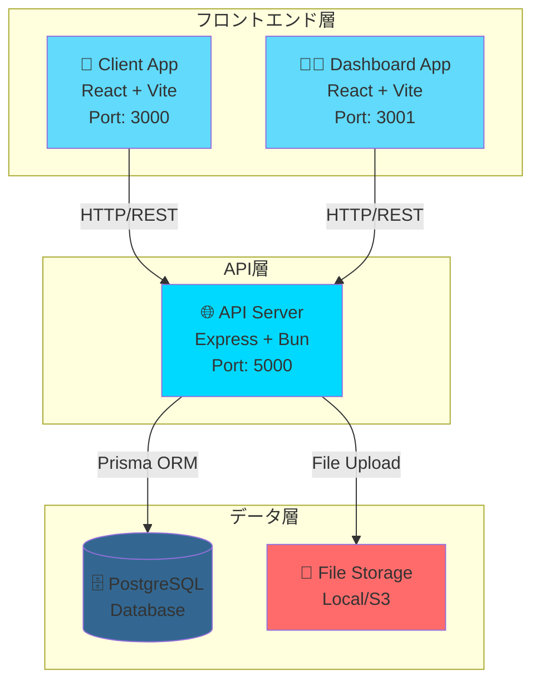
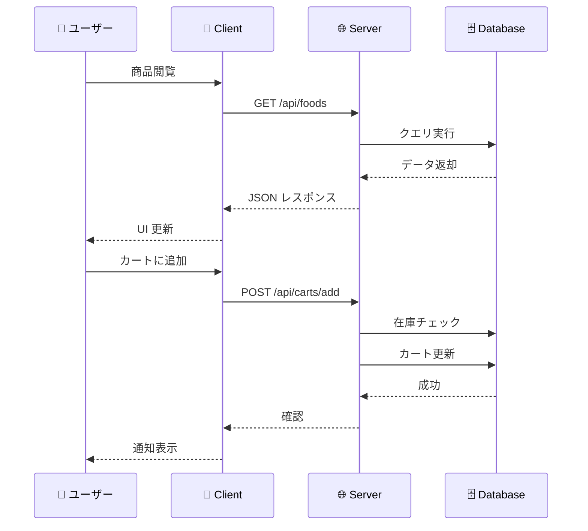

# 🍔 Food Delivery Platform

<div align="center">


**モダンで高性能なフードデリバリープラットフォーム**

[クイックスタート](#-クイックスタート) • [アーキテクチャ](#-アーキテクチャ) • [デプロイ](#-docker-デプロイ)

</div>

---

## 📋 目次

- [概要](#-概要)
- [✨ 主な機能](#-主な機能)
- [🏗️ アーキテクチャ](#️-アーキテクチャ)
- [🛠️ 技術スタック](#️-技術スタック)
- [📦 プロジェクト構成](#-プロジェクト構成)
- [🚀 クイックスタート](#-クイックスタート)
- [📚 モジュール詳細](#-モジュール詳細)
- [🐳 Docker デプロイ](#-docker-デプロイ)
- [🔒 セキュリティ](#-セキュリティ)

---

## 🎯 概要

Food Delivery Platform は、完全なフードデリバリーソリューションを提供するモダンなフルスタックアプリケーションです。ユーザーがメニューを閲覧し、注文し、注文を追跡できるだけでなく、管理者が製品、注文、在庫を管理できる包括的なプラットフォームです。

### 🌟 特徴

- ✅ **完全な型安全性** - TypeScript による完全な型定義
- ✅ **モダンなUI/UX** - React 19 + Tailwind CSS による美しいインターフェース
- ✅ **高性能** - Bun ランタイムによる高速なバックエンド
- ✅ **スケーラブル** - マイクロサービスアーキテクチャ
- ✅ **セキュア** - JWT認証、RBAC、レート制限
- ✅ **Docker対応** - ワンコマンドでデプロイ可能

---

## ✨ 主な機能

### 👥 ユーザー向け機能

- 🔐 **認証システム** - JWTベースの安全な認証
- 🛒 **ショッピングカート** - リアルタイムカート管理
- 📦 **注文管理** - 注文作成、追跡、キャンセル
- 🔍 **商品検索** - カテゴリフィルターと検索機能
- 📱 **レスポンシブデザイン** - モバイルファースト設計

### 👨‍💼 管理者向け機能

- 📊 **ダッシュボード** - 売上統計とデータ可視化
- 🍕 **商品管理** - CRUD操作、画像アップロード
- 📋 **注文管理** - 注文ステータス更新、履歴追跡
- 📁 **カテゴリ管理** - カテゴリの作成と管理
- 📈 **分析機能** - 売上トレンド、人気商品分析

### ⚙️ システム機能

- 🔒 **在庫管理** - 楽観的ロックと悲観的ロック
- 🚀 **パフォーマンス最適化** - 自動キャッシング、コード分割
- 🛡️ **セキュリティ** - レート制限、入力検証、CORS設定
- 📝 **完全な型定義** - エンドツーエンドの型安全性

---

## 🏗️ アーキテクチャ

### システムアーキテクチャ図



### データフロー



---

## 🛠️ 技術スタック

### フロントエンド

| モジュール         | 技術                      | 説明              |
| ------------- | ----------------------- | --------------- |
| **Client**    | React 19 + TypeScript   | ユーザー向けアプリケーション  |
| **Dashboard** | React 19 + TypeScript   | 管理者向けダッシュボード    |
| **UI**        | Radix UI + Tailwind CSS | モダンなUIコンポーネント   |
| **状態管理**      | Zustand                 | 軽量な状態管理         |
| **データフェッチ**   | TanStack Query          | サーバー状態管理        |
| **ルーティング**    | React Router v7         | クライアントサイドルーティング |

### バックエンド

| カテゴリ        | 技術            | 説明                 |
| ----------- | ------------- | ------------------ |
| **ランタイム**   | Bun 1.0       | 高速なJavaScriptランタイム |
| **フレームワーク** | Express 5     | Webアプリケーションフレームワーク |
| **言語**      | TypeScript    | 型安全な開発             |
| **データベース**  | PostgreSQL 16 | リレーショナルデータベース      |
| **ORM**     | Prisma        | 型安全なデータベースアクセス     |
| **認証**      | JWT           | トークンベース認証          |

### インフラストラクチャ

| ツール                | 用途                |
| ------------------ | ----------------- |
| **Docker**         | コンテナ化             |
| **Docker Compose** | マルチコンテナ管理         |
| **Nginx**          | リバースプロキシ・静的ファイル配信 |

---

## 📦 プロジェクト構成

```
Food-del/
├── 📱 food-del-client/          # ユーザー向けフロントエンド
│   ├── src/
│   │   ├── api/                # API呼び出し層
│   │   ├── components/         # Reactコンポーネント
│   │   ├── pages/              # ページコンポーネント
│   │   ├── hooks/              # カスタムフック
│   │   ├── stores/             # Zustand状態管理
│   │   └── types/              # TypeScript型定義
│   ├── Dockerfile
│   └── README.md              # 📖 [詳細ドキュメント](./food-del-client/README.md)
│
├── 👨‍💼 food-del-dashboard/      # 管理者向けダッシュボード
│   ├── src/
│   │   ├── api/                # API呼び出し層
│   │   ├── components/         # Reactコンポーネント
│   │   ├── pages/              # ページコンポーネント
│   │   ├── hooks/              # カスタムフック
│   │   └── configs/           # 設定ファイル
│   ├── Dockerfile
│   └── README.md              # 📖 [詳細ドキュメント](./food-del-dashboard/README.md)
│
├── 🌐 food-del-server/         # バックエンドAPIサーバー
│   ├── src/
│   │   ├── controllers/        # HTTPリクエストハンドラー
│   │   ├── services/           # ビジネスロジック層
│   │   ├── routes/             # ルーティング定義
│   │   ├── middleware/         # ミドルウェア
│   │   └── types/              # TypeScript型定義
│   ├── prisma/                 # データベーススキーマ
│   ├── storage/                # ファイルストレージ
│   ├── Dockerfile
│   └── README.md              # 📖 [詳細ドキュメント](./food-del-server/README.md)
│
├── 🐳 docker-compose.yml       # Docker Compose設定
├── 📝 .env                     # 環境変数設定
└── 📚 docs/                    # プロジェクトドキュメント
```

---

## 🚀 クイックスタート

### 前提条件

- **Bun** 1.0以上 または **Node.js** 18以上
- **PostgreSQL** 14以上
- **Docker** と **Docker Compose**（推奨）

### 1️⃣ リポジトリのクローン

```bash
git clone https://github.com/Manglai0813/Food-del.git
cd Food-del
```

### 2️⃣ 環境変数の設定

ルートディレクトリに `.env` ファイルを作成：

```env
# PostgreSQLデータベース設定
POSTGRES_DB=food_delivery
POSTGRES_USER=postgres
POSTGRES_PASSWORD=your_password_here

# バックエンドサーバー設定
JWT_SECRET=your-super-secret-key-at-least-32-characters-long
JWT_REFRESH_SECRET=your-refresh-secret-key-at-least-32-characters-long
CORS_ALLOWED_ORIGINS=http://localhost:3000,http://localhost:3001

# フロントエンド設定
VITE_API_URL=http://localhost:5000
VITE_API_BASE_URL=http://localhost:5000
```

### 3️⃣ Docker Composeで起動（推奨）

```bash
# すべてのサービスを起動
docker-compose up -d

# ログを確認
docker-compose logs -f

# サービスを停止
docker-compose down
```

**アクセスURL:**

- 🌐 **API Server**: http://localhost:5000
- 📱 **Client App**: http://localhost:3000
- 👨‍💼 **Dashboard**: http://localhost:3001

### 4️⃣ 手動セットアップ（開発環境）

#### バックエンドのセットアップ

```bash
cd food-del-server

# 依存関係のインストール
bun install

# データベースマイグレーション
bunx prisma migrate dev

# Prismaクライアントの生成
bunx prisma generate

# 開発サーバーの起動
bun run dev
```

#### フロントエンドのセットアップ

```bash
# Client
cd food-del-client
bun install
bun run dev

# Dashboard（別のターミナル）
cd food-del-dashboard
bun install
bun run dev
```

---

## 📚 モジュール詳細

### 📱 Client Application

ユーザー向けのフロントエンドアプリケーション。商品の閲覧、カート管理、注文機能を提供します。

**主な機能:**

- 🛍️ 商品閲覧と検索
- 🛒 ショッピングカート
- 📦 注文作成と追跡
- 👤 ユーザー認証

**技術スタック:**

- React 19 + TypeScript
- TanStack Query
- Zustand
- Tailwind CSS

📖 **[詳細ドキュメント →](./food-del-client/README.md)**

---

### 👨‍💼 Dashboard Application

管理者向けのダッシュボード。売上統計、商品管理、注文管理機能を提供します。

**主な機能:**

- 📊 売上統計とデータ可視化
- 🍕 商品管理（CRUD）
- 📋 注文管理とステータス更新
- 📁 カテゴリ管理

**技術スタック:**

- React 19 + TypeScript
- TanStack Query + Table
- Recharts（データ可視化）
- Axios

📖 **[詳細ドキュメント →](./food-del-dashboard/README.md)**

---

### 🌐 Server Application

RESTful APIを提供するバックエンドサーバー。認証、商品管理、注文処理、在庫管理を担当します。

**主な機能:**

- 🔐 JWT認証と認可
- 🍕 商品とカテゴリ管理
- 📦 注文処理とトランザクション
- 📊 在庫管理（楽観的/悲観的ロック）
- 📁 ファイルアップロード

**技術スタック:**

- Bun + Express 5
- PostgreSQL + Prisma
- JWT認証
- Zodバリデーション

📖 **[詳細ドキュメント →](./food-del-server/README.md)**

---

## 🐳 Docker デプロイ

### ビルドと起動

```bash
# すべてのサービスをビルド
docker-compose build

# バックグラウンドで起動
docker-compose up -d

# ログを確認
docker-compose logs -f server
docker-compose logs -f client
docker-compose logs -f dashboard
```

### 個別サービスの管理

```bash
# 特定のサービスのみ起動
docker-compose up -d server

# サービスの再起動
docker-compose restart server

# サービスの停止
docker-compose stop server

# サービスの削除
docker-compose down server
```

### データベースのマイグレーション

```bash
# コンテナ内でマイグレーション実行
docker-compose exec server bunx prisma migrate deploy
```

---

## 🔒 セキュリティ

### 認証と認可

- 🔐 **JWT認証** - トークンベースの安全な認証
- 👥 **RBAC** - 役割ベースアクセス制御
- 🔑 **パスワードハッシュ化** - bcryptによる安全な保存
- 🔄 **トークンリフレッシュ** - 自動トークン更新

### セキュリティミドルウェア

- 🛡️ **Helmet** - セキュリティHTTPヘッダー
- 🌐 **CORS** - クロスオリジンリクエスト制御
- ⚡ **レート制限** - API 滥用防止
- ✅ **入力検証** - Zodスキーマによる厳格な検証

### データ保護

- 🔒 **SQLインジェクション対策** - ORMによる保護
- 🛡️ **XSS対策** - Reactの自動エスケープ
- 🔐 **CSRF対策** - トークン検証
- 📝 **パラメータ検証** - すべての入力を厳格に検証

---

## 🧪 テスト

### テストユーザー

管理者ユーザーの作成方法については、各モジュールのREADMEを参照してください。

**推奨方法:**

1. ユーザー登録APIでユーザーを作成
2. PostgreSQLでroleを'admin'に更新

```sql
UPDATE users SET role = 'admin' WHERE email = 'your-email@example.com';
```

---

## 🚀 パフォーマンス最適化

- ⚡ **コード分割** - React.lazyによる遅延ローディング
- 💾 **自動キャッシング** - TanStack Queryによる効率的なキャッシング
- 🎯 **バンドル最適化** - Viteによる最適なチャンク分割
- 🗄️ **データベースインデックス** - クエリパフォーマンスの最適化
- 🔄 **楽観的更新** - UIの即座な更新

---

## 📊 プロジェクト統計

- 📦 **3つの主要モジュール** - Client, Dashboard, Server
- 🗄️ **1つのデータベース** - PostgreSQL
- 🐳 **4つのDockerコンテナ** - Postgres, Server, Client, Dashboard
- 📝 **完全な型定義** - エンドツーエンドの型安全性
- 🔒 **セキュアな認証** - JWT + RBAC

---

⭐ このプロジェクトが役に立ったら、スターを付けてください！
